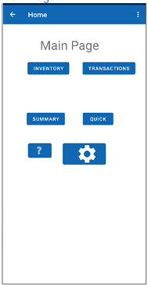
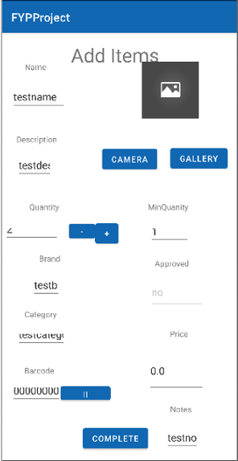
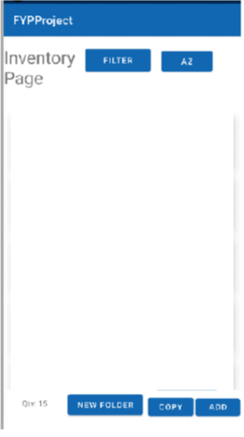
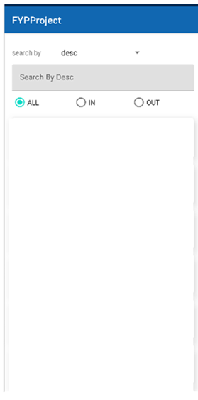
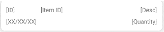

# Project Title: Charity Inventory

## Description
This is an application that helps charities manage their inventory.

This is a Charity Inventory application that is for my college's Final Year Project module.

## Instructions To Use
1. Download the application on an Android phone.
2. Register an account.
3. Start tracking inventory.
4. Use Reports and Transactions to help understand your inventory.

## Frontend Screenshots
### 1. Main Page

### 2. Add Page

### 3. Inventory Page 

#### a.

### 4. Transaction Page

#### a.

